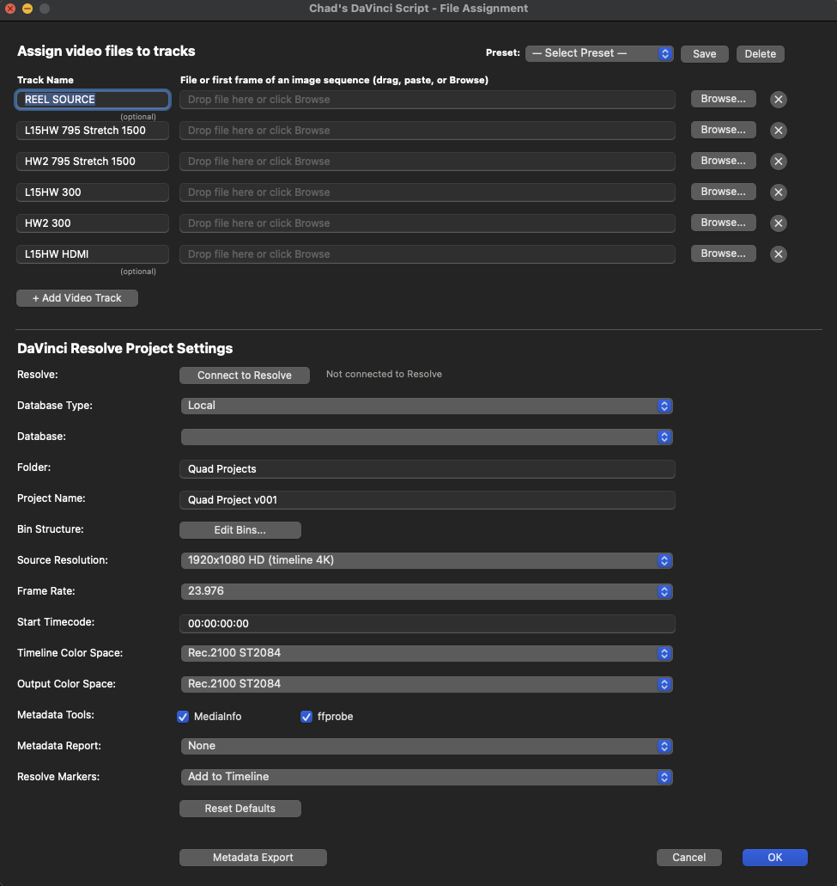
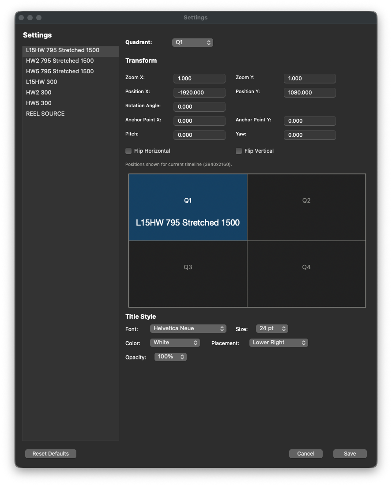

# Chad's DaVinci Script

A native macOS app that automates DaVinci Resolve project setup for
**quad-view HDR metadata testing**. One click takes you from a folder
of media files to a fully-configured Resolve project: bin structure,
imports, 8K/4K timeline, quad-view transforms, color management,
SDI monitoring, and metadata reports — all from a single Cocoa form.

Built with **PyObjC + py2app**. Distributed as a **signed, notarized
DMG** that opens with no Gatekeeper warnings on any modern Mac.

[](https://github.com/chadlittlepage/chads-davinci-script/actions)

## What's New in v0.4.0

- **Video track text overlays** — check the "T" box next to any track to
  burn the track name into the video via Fusion TextPlus. No Fusion page
  switch (uses `AddFusionComp` directly from the Edit page). Works for
  built-in tracks and extras.
- **Title Style settings** (`Cmd+,`) — choose font (20 standard macOS
  fonts), point size (10-72pt), color (7 options), placement (7 positions),
  and opacity (100/75/50/25%) for text overlays.
- **Quad preview** in Settings — live preview of font, color, and opacity.
  Shows which quadrant each track will land in with the track name rendered
  in the selected style.
- **Settings dialog** moved to app menu with `Cmd+,` shortcut. `ESC` or
  `Cmd+.` closes, `Return` saves. Single-instance (no duplicate windows).
- **Track order matches Resolve** — picker shows V7 at top, V2 at bottom.
- **Extra tracks get quadrant transforms** — default Q1 or custom from
  Settings.
- **4K/8K Square Division (SQ)** — set via combined UI automation (single
  Project Settings dialog for both playback frame rate and SQ format).
- **Import/bin retry** — 3 attempts with delay for Resolve API flakiness.
- **Persistent settings** — all GUI settings remembered between launches;
  file paths cleared on each launch.
- **macOS 15/16 compatibility** — deprecated APIs replaced with modern
  equivalents. Crash hardening for PyObjC pointer authentication traps.

## Features

### File picker (Cocoa)
- Native drag-and-drop with blue-outline drop target highlight
- **Drop a folder (or multi-file selection) → auto-route files to the
  right rows by filename pattern** (e.g. `*HW2*300nit*.mov` → HW2 300
  nit row, `*HDMI*` → L1SHW HDMI row, etc.). Six rows filled in one drag.
- **Stray quotes around pasted file paths are stripped automatically**
  — paste `'/Users/.../My File.mov'` from a terminal and it Just Works
- **Auto-launches DaVinci Resolve** if it isn't already running
  (clicks "Connect to Resolve" or "Build" — script does the rest,
  waits up to 90s for the scripting API, keeps the picker on top)
- **Custom track names auto-route too** — rename a track to e.g.
  `Sony BVM-X300` and any file containing those tokens (separator-
  insensitive: `_`, `-`, space, `.` all work) will land on that row.
- Drop a single frame from a DPX/TIFF/EXR/JPEG sequence — Resolve
  auto-imports the entire numbered sequence as one clip
- 6 fixed quad-view track rows + dynamic **"+ Add Video Track"** for
  unlimited extras inserted at the top of the stack
- Browse… button (NSOpenPanel), paste path with `Cmd+V`
- Tooltip on every drop field shows the **complete file path** on
  hover (truncated-at-head display so the filename is always visible)
- Field width: 580px, ~80 chars visible at once before truncation
- All form values **auto-save and restore** between launches
- **Reset Defaults** button wipes everything back to factory state

### Pre-flight validation
- Before every build, the picker runs a quick MediaInfo sweep across
  all assigned files and checks that:
  - Every file actually exists on disk (catches unmounted volumes)
  - **Frame rate** matches across all enabled rows
  - **Resolution** matches
  - **Color space** matches (the whole point of HDR-test workflows)
  - **Bit depth** matches
- If any check fails, a warning dialog lists every issue with two
  buttons: Cancel (fix the assignments) or Continue Anyway (build
  with the mismatch on purpose)
- If pre-flight finds nothing wrong, no dialog appears — the build
  just starts immediately
- Takes ~1-2 seconds for 6 files; the MediaInfo result is cached so
  the actual build doesn't re-extract

### Named presets
- Save / recall / delete from a top-right dropdown
- A preset captures every form field including extras: track names,
  paths, project name, folder, source resolution, frame rate, color
  spaces, metadata tools, report format, marker option

### Editable bin tree
- Native NSOutlineView side window
- Add / Add Sub / Rename / Delete operations
- **Save** persists as the new default; **Revert to Default**
  restores the factory bin structure
- Renames automatically update the track→bin mapping

### Settings (`Cmd+,`)



Open from the app menu or press `Cmd+,`. Only one Settings window at a
time. `ESC` or `Cmd+.` cancels, `Return` saves.

**Quadrant Transforms** — select any track from the left panel to assign
it to a quadrant (Q1 top-left, Q2 top-right, Q3 bottom-left, Q4
bottom-right). Fine-tune Pan, Tilt, Zoom, Rotation, Anchor Point, Pitch,
Yaw, and Flip. Changes sync bidirectionally with the picker's Quad
dropdown — editing either one updates the other in real time.

**Quad Preview** — a simulated video screen shows which quadrant the
selected track will land in. The track name is rendered in the currently
selected title font, color, and opacity so you can see exactly how text
overlays will look before building.

**Build Options**
- **Skip V1 quadrant templates** — skip the Solid Color compound clips
  on V1 for faster builds when you don't need the reference overlays

**Title Style** — controls the appearance of text overlays (the "T"
checkbox per track in the picker):
- **Font** — 20 standard macOS fonts (Helvetica Neue, Arial, Avenir,
  Futura, Gill Sans, Verdana, Trebuchet MS, Optima, Lucida Grande,
  Didot, Baskerville, Palatino, Georgia, Times New Roman, Hoefler Text,
  American Typewriter, Copperplate, Menlo, Monaco, Courier New)
- **Size** — standard point sizes from 10pt to 72pt (default: 24pt)
- **Color** — White, Yellow, Cyan, Green, Red, Orange, Black
- **Placement** — Lower Right, Lower Left, Upper Right, Upper Left,
  Center, Lower Center, Upper Center
- **Opacity** — 100%, 75%, 50%, 25%

All settings are saved to `~/Library/Application Support/Chads DaVinci
Script/quadrant_settings.json` and persisted across launches. They are
also included in preset saves and settings export/import.

### Resolve project automation
- Database / folder / project navigation (Local, Network, Cloud)
- Auto-replace if project of same name exists
- Builds the bin/sub-bin structure in the media pool
- Imports each assigned file into the correct bin (with three-API
  fallback chain to handle Resolve sequence-detection quirks)
- Creates 7-track timeline with auto-applied quad transforms
  (V3 = Q1 TL, V4 = Q2 TR, V5 = Q3 BL, V6 = Q4 BR)
- V1 (QUAD Template) auto-generated as 4 Solid Color compound clips
- Extras imported into a Master/Extras bin and added as new video
  tracks above the quad layout, with quadrant transforms applied
- **Text overlays** — optional per-track text burn-in via Fusion
  TextPlus. Configurable font, size, color, and placement in Settings.
  No Fusion page switch required.
- Sets timeline resolution (4K or 8K based on Source dropdown)
- Sets timeline frame rate (23.976 / 24 / 25 / 29.97 / 30 / 48 / 50 /
  59.94 / 60)
- Sets playback frame rate and 4K/8K Square Division (SQ) format via
  API or combined AppleScript fallback (single dialog open)
- Sets video monitoring (4:4:4 SDI, Quad link, Full data levels,
  12-bit → 10-bit → 8-bit fallback chain)
- Sets color management (DaVinci YRGB, configurable Timeline + Output
  color spaces from 25 supported presets)
- Sets image scaling (Sharper, Center crop, Match timeline)
- Sets start timecode

### Metadata extraction
- Bundled **MediaInfo** (universal) and **ffprobe** (arm64) — no
  install required
- Per-file extraction: codec, resolution, frame rate, bit depth,
  color space, color primaries, transfer characteristics, matrix
  coefficients, HDR10 (MaxCLL, MaxFALL, mastering display), Dolby
  Vision (profile, level, RPU, BL signal compatibility, EL type)
- **Image sequence detection** — drop one frame, get the full
  sequence frame count and duration
- **Multi-format reports**: Text / CSV / JSON / HTML / All formats
- **Resolve markers**: Add to Timeline / Export as EDL / Both / None

### Metadata-only mode
- Click "Metadata Export" instead of OK to skip the Resolve build
  entirely and just extract metadata + reports + EDL markers
- Folder picker for output destination
- Finder opens at the export folder when done

### Build pipeline UX
- **First-launch welcome dialog** explains the macOS Apple Events
  permission prompt and other expectations
- **Floating progress panel** appears at `NSScreenSaverWindowLevel`
  during the build with phase-by-phase status updates ("Extracting
  metadata…", "Connecting to DaVinci Resolve…", "Building Resolve
  project…", "Done!")
- Progress panel stays above DaVinci Resolve and any Resolve modal
  dialogs; can't be closed accidentally
- **Build complete / Build failed dialogs** at the end via osascript
  display dialog (reliable z-order, no NSAlert focus fight)

### Diagnostics + observability
- **System probe at session start**: macOS version, architecture,
  Python version, PyObjC version, app version, locale, screen info,
  bundled binary paths/sizes/architectures
- **Resolve API probe** logs Resolve product, version, database
  count at connection time
- **Bundled tool version logging** on first use of mediainfo/ffprobe
- **Global unhandled-exception hook** (main thread + background
  threads) writes full tracebacks to `console.log` instead of
  losing them behind py2app's bare "fatal error" dialog
- **Help → Export Console Log…** captures both the .log file AND
  a PNG screenshot of the picker, side-by-side, named with a
  timestamp
- **Console log auto-rotation**: archived to `console.log.old`
  after 30 days; tail-truncated to last 5 MB after 10 MB
- **Verbose error logging** for every subprocess failure, every
  validation message, every dialog the app pops up

### Supported file formats
The picker accepts **any file extension** (no whitelist filter).
Catalog of formats Resolve can ingest:

- **Container**: `.mov`, `.mp4`, `.m4v`, `.mkv`, `.avi`, `.webm`,
  `.mxf`, `.ts`, `.m2t`, `.m2ts`, `.mts`, `.3gp`, `.vob`, `.ogv`
- **Camera RAW**: `.braw` (Blackmagic), `.r3d` (RED), `.ari`/`.arx`
  (ARRI), `.crm`/`.rmf` (Canon Cinema RAW Light), `.dng`
  (CinemaDNG), `.cine` (Phantom), `.nev` (Nikon N-RAW)
- **360° / VR**: `.insv` (Insta360 stitched 360 video)
- **Camera proxies**: `.lrv` (GoPro/Insta360), `.lrf` (DJI)
- **Image sequences**: `.dpx`, `.tif`/`.tiff`, `.exr`, `.jpg`/`.jpeg`,
  `.jp2`/`.j2k`, `.png`, `.tga`, `.bmp`, `.hdr`, `.cin`, `.insp`
- **Audio**: `.wav`, `.aif`/`.aiff`, `.flac`, `.mp3`, `.m4a`, `.aac`

Codec coverage (carried inside the containers above): ProRes
(422/HQ/LT/Proxy/4444/4444 XQ), Avid DNxHD/DNxHR, H.264, H.265 / HEVC,
XAVC / XAVC-I / XAVC-S, AVC-Intra, AVCHD, MPEG-2 (XDCAM HD/EX),
MPEG-4, DV, DVCPRO, HDV, GoPro Cineform, Sony X-OCN, Atomos
ProRes RAW.

Camera brands explicitly tested or documented: ARRI, RED, Blackmagic,
Sony Venice/FX/α series, Canon Cinema/EOS R, Nikon Z8/Z9, Fujifilm
X/GFX, Panasonic Lumix/VariCam, Z CAM, GoPro, Insta360, DJI, Phantom,
Atomos external recorders, iPhone, Android.

### Distribution
- **Apple Developer ID** signed with **Hardened Runtime**
- **Notarized** by Apple's notary service
- **Stapled** for offline verification
- **Drag-to-install DMG** with custom carbon-nanotube background
  and 105px icon size
- Public download URL — no GitHub login required:
  <https://github.com/chadlittlepage/chads-davinci-script-releases/releases/latest>

### Build pipeline (CI/CD)
- **GitHub Actions CI** (`ci.yml`) runs ruff lint + Python syntax
  check on every push and PR
- **GitHub Actions Release** (`release.yml`) triggered by `git tag v*`:
  imports the Developer ID cert from a base64 secret, downloads
  bundled binaries from the `build-deps-v1` release, runs
  `build_and_sign.sh`, and publishes the notarized DMG to BOTH
  the private source repo AND the public mirror repo
- **Local build** via `./build_and_sign.sh` with the same
  signing/notarization pipeline
- **Dependabot** auto-PRs for pip + GitHub Actions versions monthly

## Install (end users)

Public download (no GitHub login required):
<https://github.com/chadlittlepage/chads-davinci-script-releases/releases/latest>

Drag the `.app` from the DMG to `/Applications` and launch. The
first time you set the playback frame rate, macOS will ask to
allow the app to control DaVinci Resolve — click OK once.

The first launch shows a welcome dialog explaining what to expect.
Subsequent launches skip it.

## Build from source (developers)

### Prerequisites

- macOS 11+ (tested on macOS 14, 15, 26)
- Python 3.11+ in `.venv-build/`
- DaVinci Resolve 20.x installed (for actual builds; not needed for
  metadata-only mode)
- (For releases) An Apple Developer ID Application certificate in
  your login keychain and a notarytool keychain profile — see the
  comments at the top of `build_and_sign.sh` and `MAINTAINING.md`.

### Bundled binaries (one-time)

`mediainfo` and `ffprobe` are NOT checked into the repo. Drop static
arm64 builds into `bin/`:

```
bin/mediainfo
bin/ffprobe
```

See `bin/README.md` for download links and the exact command to
verify them.

### Run from source

```bash
PYTHONPATH=src python3 -m chads_davinci.build_main
```

### Build a signed, notarized DMG

```bash
./build_and_sign.sh
```

Output: `dist/Chads DaVinci Script.dmg`. The script handles
deep-signing, hardened-runtime entitlements, notarization submission,
ticket stapling, DMG creation via dmgbuild, and DMG signing /
notarization / stapling — all in one go (~3-15 minutes depending on
how busy Apple's notary service is).

### Cut a release

```bash
# Bump version in src/chads_davinci/__init__.py, setup.py, pyproject.toml
git commit -am "Release v0.2.X"
git tag -a v0.2.X -m "v0.2.X"
git push origin main v0.2.X
```

GitHub Actions takes over: builds, signs, notarizes, staples, and
publishes the DMG to both the private source repo and the public
mirror in ~3-15 minutes. See `.github/RELEASE_SETUP.md` for the
one-time secret setup.

## Project layout

```
.
├── app_entry.py            # py2app entry — wraps build_main.main()
├── setup.py                # py2app build config
├── pyproject.toml          # package metadata
├── entitlements.plist      # hardened runtime + automation entitlements
├── build_and_sign.sh       # one-shot release pipeline
├── dmg_settings.py         # dmgbuild config (window layout, BG, icon size)
├── assets/                 # icon, background image, iconset
├── bin/                    # bundled mediainfo + ffprobe (NOT in repo)
└── src/chads_davinci/
    ├── __init__.py             # __version__
    ├── about_window.py         # About dialog with carbon-nano BG
    ├── bin_editor.py           # native NSOutlineView bin editor
    ├── build_main.py           # parent process entry point + orchestrator
    ├── build_worker.py         # subprocess for clean Resolve API state
    ├── console_log.py          # tee stdout/stderr to console.log + rotation
    ├── diagnostics.py          # system probe + exception hook + screenshot
    ├── file_picker.py          # main Cocoa picker window (the big one)
    ├── manual_window.py        # in-app manual / Help
    ├── menu_bar.py             # native macOS menu bar
    ├── metadata.py             # MediaInfo + ffprobe + report writers
    ├── models.py               # TrackRole, BIN_STRUCTURE, transforms,
    │                           # SUPPORTED_VIDEO_EXTENSIONS, etc.
    ├── paths.py                # sandbox-friendly app support paths
    ├── progress_window.py      # floating NSPanel build progress UI
    ├── resolve_connection.py   # all DaVinci Resolve API calls
    ├── settings_io.py          # user settings + presets persistence
    └── ui_automation.py        # AppleScript playback frame rate fallback
```

See [`MAINTAINING.md`](MAINTAINING.md) for the full developer guide
(common tasks, secrets reference, architecture notes, troubleshooting).

## License

Proprietary — see [LICENSE](LICENSE). All rights reserved.

## Author

Chad Littlepage
<chad.littlepage@gmail.com>
